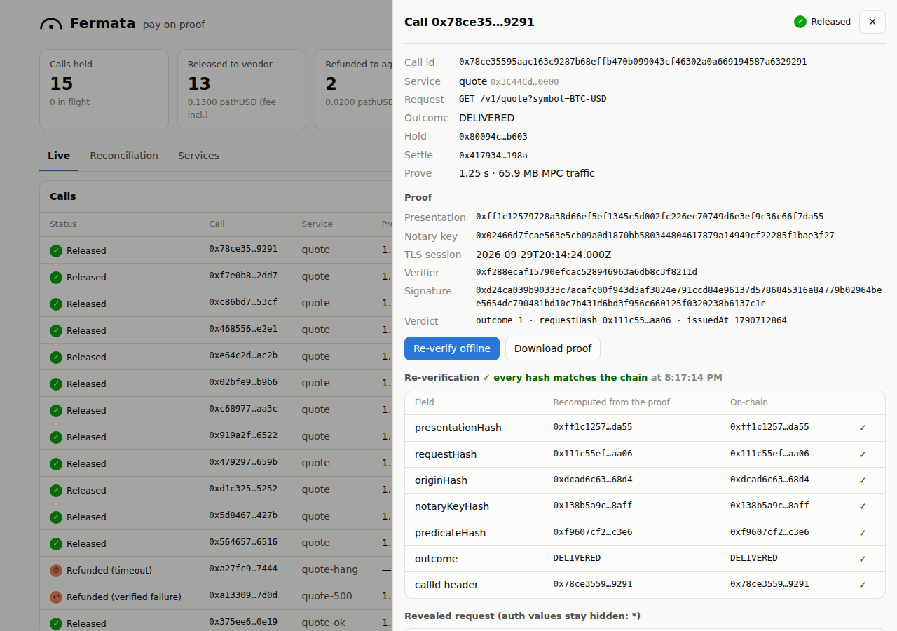
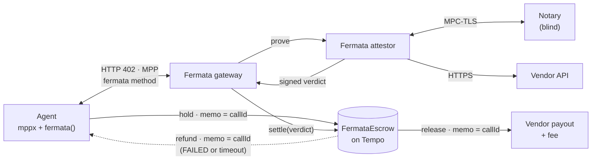
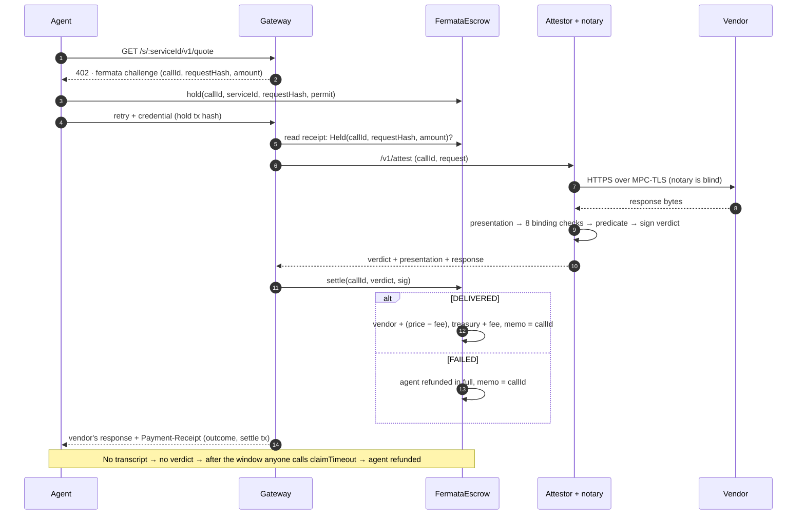
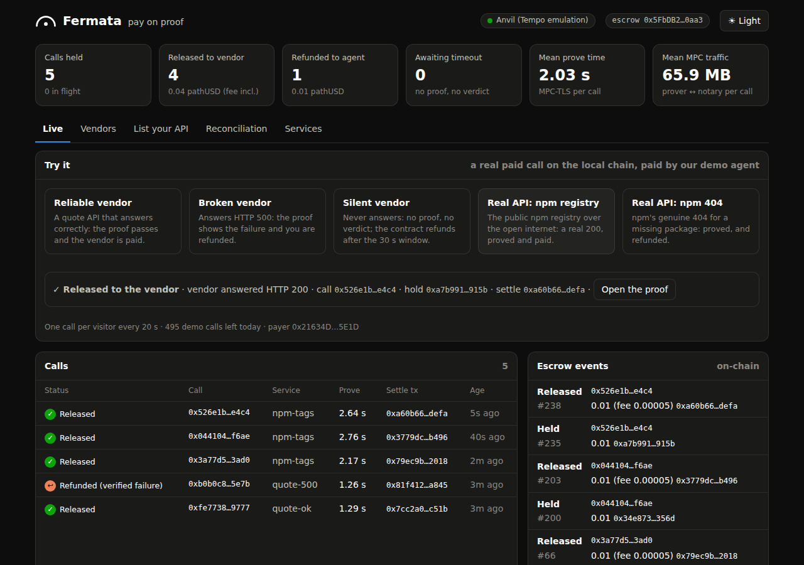
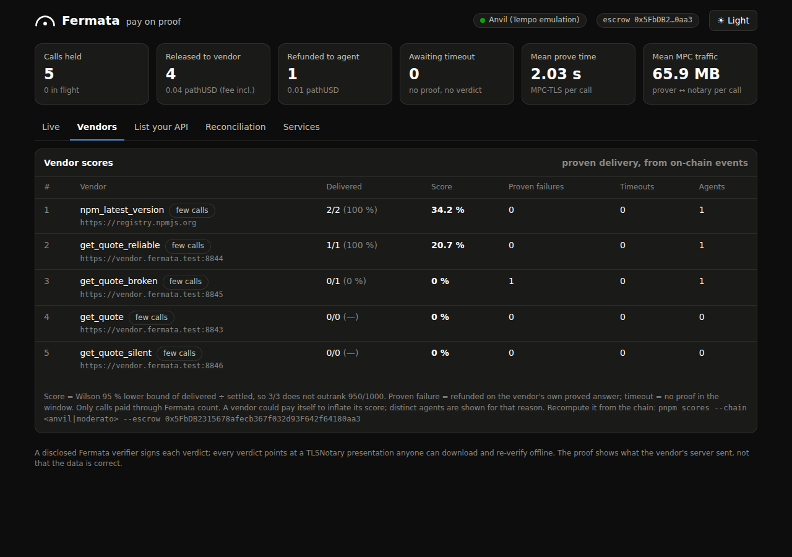
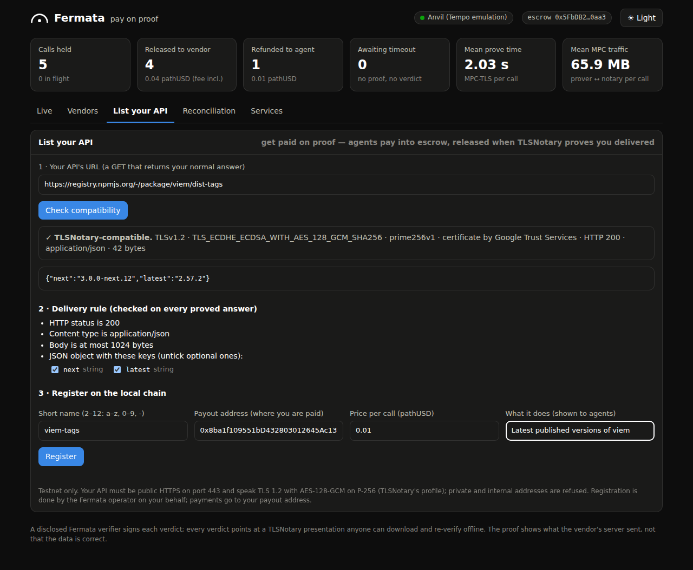
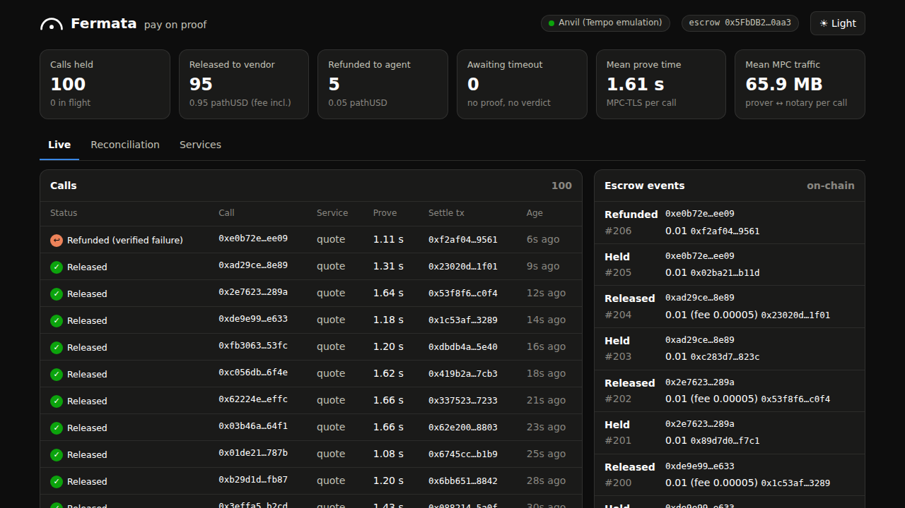

<p align="center"></p>

# 𝄐 Fermata — Pay on proof

**Chargebacks for machine payments, decided on cryptographic evidence instead of a support ticket.**

A card payment has a chargeback: when the goods never arrive, the buyer disputes and a person
reads the ticket. An agent paying an API per call has nothing — it pays, the API answers with a
500 or with garbage, and the money is gone. Fermata is the chargeback for that payment, except no
one reads a ticket: the payment is **held** in escrow on [Tempo](https://tempo.xyz), the vendor's
HTTPS response is recorded with [TLSNotary](https://github.com/tlsnotary/tlsn), and the hold is
**released** to the vendor only when that record passes a pre-agreed, mechanically checkable
delivery predicate. A verified failure, or an expired proof window, **refunds** the agent.

Fermata holds an agent's Tempo payment for an API call until an independently verifiable record of
the vendor's HTTPS response (a TLSNotary presentation) passes a pre-agreed, mechanically checkable
delivery predicate. A verified failure, or an expired proof window, returns the payment to the
agent. In v1 a disclosed Fermata verifier signs the on-chain settlement decision; anyone can
re-verify the evidence it decided on.

**How this differs from x402/MPP receipts:** receipts prove the buyer paid. Fermata proves what the
seller delivered, holds the money until that check passes, and refunds by rule when it doesn't.

Vocabulary throughout the code and docs: `hold → release(proof) → refund`. (A fermata, 𝄐, is the
musical symbol that holds a note; Tempo is a music-named chain; we hold the payment until the
proof lands.)



## How it works





| Part | What it is |
|---|---|
| [`contracts/src/FermataEscrow.sol`](contracts/src/FermataEscrow.sol) | `hold → settle(verdict) \| claimTimeout`. Per-call holds pulled with a TIP-20 permit; `…WithMemo` transfers with memo = callId; EIP-712 verdicts from one registered verifier per service; service pins the origin, the notary key hash and the predicate hash; 0.5 % fee on release. |
| [`apps/attestor`](apps/attestor) | `fermata-attest` (Rust, TLSNotary `v0.1.0-alpha.15`): `notary` (the blind MPC-TLS co-signer), `prove`, `verify` (binding checks + predicate + EIP-712 signing), `verify --offline` (anyone, no key), `serve` (HTTP API for the gateway). |
| [`apps/gateway`](apps/gateway) | The MPP server agents pay. Offers `fermata` (escrowed, pay on proof) and plain `tempo` (direct, tagged `unprotected`) in every challenge; settles, then responds; a sweeper claims expired holds. Serves `/proofs/:callId`, `/calls`, `/events`, `/reconcile/:callId`, `/openapi.json`, `/llms.txt`, the dashboard, and **`/mcp`**: every service as a paid MCP tool. |
| [`packages/sdk`](packages/sdk) | `fermata({ account })` for `mppx/client`, `fermataServer()` for `mppx/server`, escrow bindings, `reconcile` (movements by memo), `reclaim`. |
| [`apps/mcp`](apps/mcp) | `fermata-mcp`: the stdio MCP server an agent such as Claude launches. It pays the gateway's MCP tools from the agent's testnet wallet, with your own allow-lists and a spending cap. |
| [`apps/dashboard`](apps/dashboard) | Live Held/Released/Refunded feed, per-call proof drawer with offline re-verify, reconciliation by memo. Light/dark, works on a phone. |
| [`apps/vendor`](apps/vendor) | Demo quote API (TLS 1.2) with failure modes: 500, truncated JSON, cut connection, hang, random `CHAOS_RATE`. |

The agent adds one line to its `mppx` client:

```ts
import { Mppx } from 'mppx/client'
import { fermata } from '@fermata/sdk'
const mppx = Mppx.create({ methods: [fermata({ account })] })
const res = await mppx.fetch('https://gateway.example/s/<serviceId>/v1/quote?symbol=BTC-USD')
```

### MCP: Claude pays on proof

MCP agents get the same protection as tools. The gateway's `/mcp` endpoint exposes every service as a
paid tool, using MPP over MCP (mppx's MCP transport, credential in `_meta`). `fermata-mcp` is the
local server that Claude Code or Claude Desktop launches; it pays those tools from the agent's
testnet wallet. In a real headless Claude Code session on Anvil, given only this server:

1. Claude bought two quotes in parallel.
2. The reliable vendor's quote was **released**.
3. The broken vendor's proven HTTP 500 was **refunded**.
4. Claude re-verified the first proof against the chain and explained each outcome correctly.

Transcript and setup: [`apps/mcp/README.md`](apps/mcp/README.md). `pnpm demo:mcp` runs the same flow
as a script (6/6 PASS on Anvil).

```sh
claude mcp add fermata -e FERMATA_AGENT_KEY=0x… -e FERMATA_TRUSTED_VERIFIERS=0x… … -- tsx apps/mcp/src/index.ts
```

## The product: pay on proof, vendor scores, self-serve onboarding

Fermata is more than an escrow: every verdict is also an on-chain record of whether a vendor
delivered. The hosted demo (Tempo testnet; [`deploy/`](deploy/README.md)) has three surfaces.

**Try it.** Each button makes a real paid call: hold on-chain, TLSNotary proof, settle.
- A server-side demo agent pays, so visitors need no wallet.
- The vendors are a reliable one, a broken one, a silent one, and the real npm registry (a 200 and a 404).
- Every call links to its transactions and its re-verifiable proof.



**Vendor scores.** Each vendor's proven delivery record comes **from the escrow's own events only**:
- released;
- refunded on a proven failure;
- refunded on timeout;
- distinct agents.

Vendors are ranked by the Wilson 95 % lower bound, so 3/3 doesn't outrank 950/1000.
`pnpm scores --chain moderato` recomputes the table from any RPC; on Anvil it matches the gateway
exactly. Agents get the same data as a free MCP tool (`fermata_vendor_scores`) and can pick
reliable vendors before paying. Two limits are stated with the scores:
- only calls paid through Fermata count;
- a vendor could pay itself, which is why distinct agents are shown.



**List your API.** A vendor pastes a URL. The gateway:
1. checks it is a public HTTPS host (never a private or internal address);
2. probes TLSNotary's TLS profile and takes a sample answer;
3. drafts the delivery rule from that sample, for the vendor to review;
4. registers the service on-chain;
5. serves it at once: an HTTP endpoint, an MCP tool, a scoreboard row.

`pnpm demo:onboard` runs this end to end against the real npm registry (7/7).



## What the proof does and does not establish

* A TLSNotary presentation establishes that a specific HTTPS server, identified by its TLS certificate, sent specific bytes in response to specific request bytes. That is all. It does not establish that the data is correct (a quoted price can be wrong), and it cannot establish that a server never responded (no transcript, no proof).
* Therefore the delivery predicate only contains things that are checkable on the transcript: status code, content type, body size, JSON shape. No latency or timing checks in the predicate — the transcript has no trusted clock. Latency SLAs, if any, are gateway policy, not proof-backed.
* No response from the vendor → no transcript → no verdict. The agent is protected by the on-chain timeout refund, never by a verdict signed without evidence.

### Trust model (v1)

The escrow contract trusts one registered verifier key per service, which Fermata holds; the notary is a separate process (run by us in the demo, pluggable to any notary running the same TLSNotary version¹) whose only job is to be blind; the gateway is the prover². A vendor therefore trusts the Fermata operator to sign honest verdicts, including refunds. What the design adds over "trust the operator": every verdict points at a presentation anyone can download and re-verify offline against the pinned notary key, so a dishonest verdict is detectable and the evidence is portable to any future adjudicator. Independent verification is not the same as independent adjudication; roadmap items (vendor-chosen verifiers, N-of-M verifier quorum, on-chain presentation verification) close that gap.

¹ *Adjusted from the brief after Milestone 0:* TLSNotary removed its notary server in
`v0.1.0-alpha.13` and PSE's public notary (`notary.pse.dev`) has been shut down
([FACTS §12.2, §14.3](docs/FACTS.md)), so the brief's "pluggable to a third-party notary such as
PSE's" became "pluggable to any notary running the same TLSNotary version". Ours is
`fermata-attest notary`; each service pins a notary key hash on-chain, so another notary is used by
registering a service with its key.
² The prover runs inside the attestor (`fermata-attest prove`), which the gateway operator runs;
both are Fermata's side of the table.

Re-verify any call yourself, with no key and no trust in the gateway:

```sh
curl -o call.tlsn http://127.0.0.1:4300/proofs/<callId>
fermata-attest verify --offline --presentation call.tlsn --ca apps/vendor/certs/ca.pem \
  --predicate apps/attestor/predicates --call-id <callId> --service-id <serviceId> \
  --request-hash <from Held> --origin-hash <from getService> --notary-key-hash <from getService>
```

or press **Re-verify** in the dashboard's proof drawer, which runs the same offline check and puts
each recomputed hash next to the one on chain.

## Demo

```sh
bash scripts/demo-stack.sh up --chain anvil    # vendors, notary, attestor, gateway + dashboard
pnpm demo:cases --chain anvil                  # the three canonical cases, pass/fail table
pnpm demo:load --calls 100 --chain anvil       # ≈97/3, timings, MPC bandwidth, gas
pnpm demo:mcp --chain anvil                    # an MCP agent pays on proof: released, refunded, verified
pnpm demo:real --chain anvil                   # a real third-party API (registry.npmjs.org): 200 released, 404 refunded
pnpm scores --chain anvil --escrow 0x…         # vendor scores recomputed from on-chain events only
PUBLIC=1 bash scripts/demo-stack.sh up         # public mode: Try it, Vendors, List your API (deploy/README.md to host it)
pnpm demo:onboard --chain anvil                # self-serve onboarding of a real API, end to end (public mode)
open http://127.0.0.1:4300/dashboard           # live feed, proof drawer, reconciliation by memo
bash scripts/demo-stack.sh down
```

`pnpm demo:cases` is the acceptance test — three canonical cases end to end, each with a
downloadable, offline-re-verifiable proof:

1. **Verified delivery → release.** Valid response; presentation passes the predicate; vendor paid
   9,950 and treasury 50 (of 10,000 = $0.01) with the call's memo.
2. **Verified failure → refund.** Authenticated HTTP 500; presentation fails the predicate; agent
   refunded with the call's memo.
3. **No proof before deadline → timeout refund.** Vendor never answers; no verdict is signed; after
   the settlement window the hold is reclaimed to the agent.



**Real third-party vendor.** Fermata is not tied to our mock vendor. The demo stack also registers
the public **npm registry** (`registry.npmjs.org`):
- the attestor proves its TLS session through our notary, and the certificate is checked against
  Mozilla's root program;
- `pnpm demo:real` checks three cases (3/3 PASS):
  1. a real 200 → **released**;
  2. npm's real **404** for a package that doesn't exist → **refunded**;
  3. the same API as an MCP tool → released.
- A proof takes ≈ 2 s over the internet, with the same 66 MB of MPC traffic (FACTS §15.6).
- Any host that fits TLSNotary's TLS 1.2 profile works. `scripts/probe-tls.sh <host>` checks one
  first (for example, api.coinbase.com for `REAL_VENDORS=npm,coinbase`).

The video storyboard, voice-over and raw-footage recorder are in [`docs/DEMO.md`](docs/DEMO.md).

**Measured on Anvil's Tempo emulation** (chain ID 42431, FACTS §15.4): 100 calls against a vendor
failing at random 3 % → **97 released, 3 refunded**, every one settled on-chain with memo = callId,
no human input; 226.8 s wall-clock, 2.15 s per call (p50), 1.13 s MPC-TLS proving (p50).
Repeat runs landed at 96/4 and 95/5 (the failures are random), 244–254 s.

**Measured on Tempo Moderato testnet** (2026-10-01, escrow
[`0x88A9886B99aC8a93475dEFBda6245161Cd1F0763`](https://explore.testnet.tempo.xyz/address/0x88A9886B99aC8a93475dEFBda6245161Cd1F0763)):
`pnpm demo:cases --chain moderato` → **3/3 PASS**; `pnpm demo:load --calls 100 --chain moderato` →
**96 released, 4 refunded**, 0 errors, 746.3 s wall-clock, 7.5 s per call (p50, dominated by waiting
for hold and settle to be included), 1.03 s MPC-TLS proving (p50); escrow fees $0.0048, gas paid by
the agent $0.0341 in pathUSD.

| Case (Moderato) | Hold | Settle / refund |
|---|---|---|
| 1 release (vendor delivers) | [tx](https://explore.testnet.tempo.xyz/tx/0xb9d627e454bb9496a50d6dac9fe17d4fb2e4f3a4a04d401e183a447f6cdcf84b) | [tx](https://explore.testnet.tempo.xyz/tx/0xd480381bb6f5ba8135065bdf228d6fd863069f942c61f4c092d27dd02d3b4463) |
| 2 verified-failure refund | [tx](https://explore.testnet.tempo.xyz/tx/0x0475e28b8095eaef2164eb85527b9810abdf182583477d1a3c27fdd823b40741) | [tx](https://explore.testnet.tempo.xyz/tx/0x65650d96981a6f40d360112ffba952c5003c9394be2f301e6ff7ef6ae4e1ce10) |
| 3 timeout refund | [tx](https://explore.testnet.tempo.xyz/tx/0x1afc771c3bf299f494ec49b240d0e3e57aab54cc9e889bdb8693a0ec0fecfbc6) | [tx](https://explore.testnet.tempo.xyz/tx/0x3da2db644387a15b54a8e568639446cc4b820deb6e4372e96d7eaee6149d2c4d) |

## Economics (measured, FACTS §15.4)

Per-call MPC proving is too slow and too bandwidth-heavy for one-cent calls at scale. In the
100-call load test every call cost **≈ 1.1–1.4 s of MPC-TLS and ≈ 66 MB of prover↔notary
traffic** on top of two transactions (hold ≈ 345k gas, settle ≈ 107k gas) — for a $0.01 quote.
v1 proves every call to demonstrate the mechanism end to end. The production shape: **session
escrow** (hold once for N calls, settle in batches), **sampled proving** (prove a random,
unpredictable subset; the vendor cannot tell which calls are checked) and **prove-on-dispute**
(proofs only when the agent flags a call, with the hold covering the dispute window).

## How Fermata compares

Agent payments today mostly prove that the buyer paid. Here is how the nearest designs handle "the
API didn't deliver":

| | Who decides delivery | Evidence | Refund path | Chain |
|---|---|---|---|---|
| x402 / MPP receipt | nobody | a payment receipt only | none | any |
| [Bursar](https://github.com/theweb3wizard/Bursar) (same track) | not in scope: invoicing, budgets and receivables; its contract "never holds funds" | on-chain payment ↔ invoice | none | Tempo |
| [Recourse](https://github.com/successaje/recourse) | Chainlink CRE enclave, after the buyer disputes with a bond | a seller-published SLA plus the seller's signature over what it sent | escrow pays the dispute winner | Hedera (via CCIP) |
| [ERC-8183](https://github.com/ethereum/ERCs/blob/master/ERCS/erc-8183.md) Agentic Commerce (draft) | one evaluator per job (the client, a third party, or a contract) | out of scope (an optional reason hash) | evaluator rejects, or anyone refunds after expiry | any EVM |
| **Fermata** | one registered verifier per service (v1: Fermata's), checking a predicate fixed on-chain | **TLSNotary presentation of the vendor's own TLS session**; anyone re-verifies it offline | automatic: verified failure → refund; no proof by the deadline → `claimTimeout` | Tempo (TIP-20 memos), MPP-native, MCP |

What is different here:

- **No cooperation from the vendor.** The evidence comes from the vendor's TLS session through a
  blind notary. The vendor doesn't sign anything, so it can't decline to.
- **No dispute step.** The agent doesn't have to notice a failure and post a bond. Every call is
  proved and settled within seconds (about 1 s of proving on Moderato, FACTS §15.5).

What is the same:

- **One trusted decider.** Like ERC-8183's single evaluator, a dishonest verifier is *detectable*
  here, not *prevented*. The trust model above says exactly that, and the roadmap targets it.

Fermata maps onto ERC-8183 one to one:

| ERC-8183 | Fermata |
|---|---|
| fund a job | `hold` (permit + `transferFromWithMemo`) |
| `submit` | the vendor answering over TLS |
| evaluator `complete` / `reject` | `settle(verdict)`: DELIVERED / FAILED |
| `claimRefund` after expiry | `claimTimeout` |

An ERC-8183 adapter with the attestor as the evaluator is a natural next step. It is not built.
Comparison checked against each project's public repository or specification on 2026-10-02.

## Roadmap

- **Vendor-chosen verifiers and an N-of-M verifier quorum** — move adjudication off the Fermata operator.
- **On-chain presentation verification** — the escrow checks the evidence itself instead of a signature over it.
- **Vendor-hosted gateways** — the vendor runs the gateway and prover next to its API.
- **Session escrow, sampled proving, prove-on-dispute** — the economics above.
- **`session` intent for streaming APIs** — per-chunk holds for streamed and long-running responses.
- **Stripe method for fiat vendors** — a `stripe` MPP method behind a flag, for vendors paid in fiat.

## Quickstart

Requires Foundry 1.8.3, Node ≥ 22.21, pnpm 10 and (for the attestor) Rust 1.95.0 via rustup.
`corepack enable pnpm` makes `pnpm` use the version pinned in `package.json` (an older global pnpm
cannot read the lockfile). Tested on Linux and macOS (bash 3.2).

```sh
git clone https://github.com/bilgin-kocak/fermata && cd fermata
git submodule update --init && pnpm install

# the demo, on a local Tempo emulation (anvil --chain-id 42431), every component a real process
bash scripts/demo-stack.sh up --chain anvil     # first run builds the attestor (several minutes)
pnpm demo:cases --chain anvil
pnpm demo:load --calls 100 --chain anvil
pnpm demo:mcp --chain anvil                     # MCP agent: released / refunded / verified (see apps/mcp)
pnpm demo:real --chain anvil                    # real vendor (registry.npmjs.org): released / refunded
open http://127.0.0.1:4300/dashboard
bash scripts/demo-stack.sh down

# tests
pnpm contracts:test       # unit, fuzz, invariant, Rust vectors, and the real TIP-20 precompile (forge --network tempo)
pnpm sdk:test             # viem EIP-712 == Rust == Solidity
pnpm gateway:test         # gateway unit tests
pnpm attest:test          # attestor unit + integration tests (real MPC-TLS)
pnpm escrow:e2e:anvil     # deploy + DELIVERED/FAILED/TIMEOUT round trip
pnpm attest:e2e:anvil     # hold → TLSNotary proof → verdict → settle
pnpm gateway:e2e:anvil    # an mppx agent pays through the gateway: DELIVERED / FAILED / no answer → refund

# Tempo Moderato testnet (testnet only; keys live in .env, never committed)
pnpm keys:init            # writes .env with fresh testnet keys; prints faucet commands
pnpm escrow:deploy --chain moderato
bash scripts/demo-stack.sh up --chain moderato
pnpm demo:cases --chain moderato
pnpm demo:load --calls 100 --chain moderato
```

`docker-compose.yml` and `apps/attestor/Dockerfile` are provided but **untested** (no Docker in the
build environment); the scripts above are the tested path.

## Status

All milestones done: escrow contract, attestor, gateway + `fermata` MPP method + SDK, demo stack
+ dashboard, submission material ([`docs/DEMO.md`](docs/DEMO.md),
[`docs/SUBMISSION.md`](docs/SUBMISSION.md), [`SECURITY.md`](SECURITY.md)). Left: the video.

**Tempo Moderato: done** (2026-10-01). Escrow deployed, `escrow:roundtrip`, gateway e2e (4/4),
`demo:cases` (3/3) and the 100-call `demo:load` all pass on Moderato; the `mppx validate` payment
phase passes too (88 passed, 0 failed; 4 warnings are the vendor's 404 for a quote request with no
`?symbol=`). The recorded video footage is from Anvil's Tempo emulation and is captioned as such.
Nothing is faked; see [`docs/PLAN.md`](docs/PLAN.md).

**Freeze:** the demo, the video and this README are frozen from **2026-10-09** (72 h before the
2026-10-12 deadline). After the freeze, only bug fixes that a failing `pnpm demo:cases` justifies.

More: [`docs/FACTS.md`](docs/FACTS.md) (verified facts about Tempo, MPP and TLSNotary, with
sources and measurements) · [`docs/PLAN.md`](docs/PLAN.md) (milestones, decisions, risks) ·
[`PROMPT.md`](PROMPT.md) (the build brief).

---

Hackathon submission for the Tempo track of Colosseum's Crypto World's Fair (deadline 2026-10-12).
Testnet only (Tempo Moderato, chain ID 42431). **Unaudited hackathon code** — see [`SECURITY.md`](SECURITY.md).
